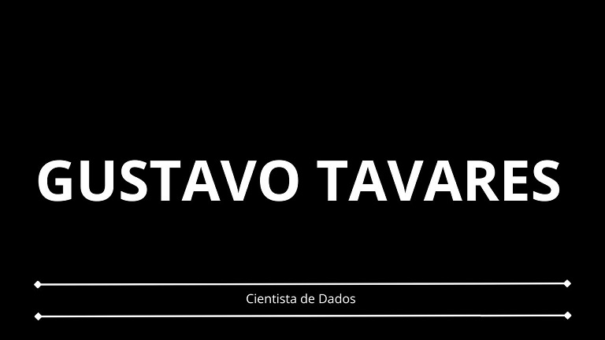

  

## Cientista de Dados | Machine Learning

Cientista de dados com conhecimento em coleta e limpeza de dados, análise exploratória, visualização e comunicação de resultados, modelagem estatistíca, aprendizado de máquina, algortimos de classificação, algoritmos de clusterização, algoritmos de regressão, algoritmos de série temporais. Proficiente em Python, SQL e Cloud. Experiente na manipulação e análise de dados, com foco na tomada de decisões baseada em dados.

## Projetos:

* **[Seguro Saúde - Algoritmo de Regressão](https://github.com/gustavoptavares/Seguro-Saude)**

* **[Jogos de Celular - Sistema de Recomendação](https://github.com/gustavoptavares/Jogos-de-Celular)**

* **[Jogo de Celular Cookie Cats - Teste A/B](https://github.com/gustavoptavares/Teste-A-B-Jogo-de-Celular)**
* 
* **[Manutenção Preditiva AI4I - Algoritmo de Classificação](https://github.com/gustavoptavares/Manutencao-Preditiva-AI4I)**

* **[Manutenção de Elevadores - Algoritmo de Série Temporais](https://github.com/gustavoptavares/Manutencao-Elevador)**

* **[Vendas Walmart - Algoritmo de Regressão](https://github.com/gustavoptavares/Walmart-Vendas)**

* **[Vinho - Algoritmo de Clusterização](https://github.com/gustavoptavares/Vinho)**
